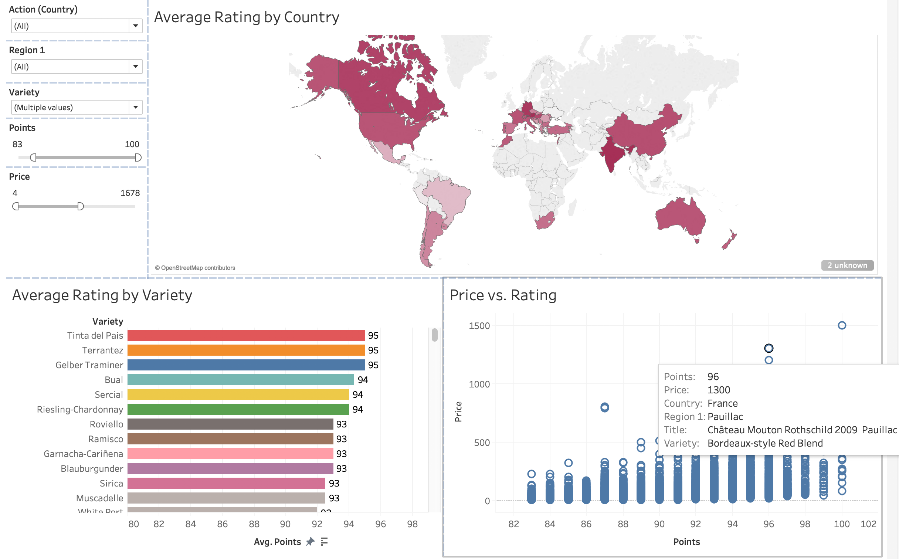

# Overview
There are a vast number of wines to choose from in the world.  The number of available options is far too big to be considered and tasted individually by anyone.  Therefore, to make informed buying decisions, you need some information about all of the options and a way to efficiently use this information.

We propose a data visualization application which will allow buyers to explore the data to identify the best value wines that have the features they desire.  The app will allow users to filter wines according to the features they are interested in and select to select individual wines according to their price and rating.  It will also let them to see the distribution of ratings across the other features that they filtered by.

# Description of the data

We will be visualizing 129,907 instances of wine reviews from WineEnthusiast with the ratings being greater than 80 points (WineEnthusiast says they do not publish ratings below 80). Each rating has 13 columns where it details the country where the wine is from (country, region_1, region_2), the description of the bottle (description, variety, title, cost), information from the taster (taster, taster_twitter_handle), and the rating. We are likely to drop the columns of `region_2` becausemore than 50% of the column is `NA`, as well as the `taster_twitter_handle` column as we deem it unnecessary. We will also be extracting the vintage year from the title of the wine to create a new column titled `vintage`. The data itself is fairly clean and well organized, we are not likely to do too much wrangling. 

# Usage scenario & tasks / question to explore
As a wine buyer for a restaurant group, I want to reduce the many available wines to a shortlist that match certain criteria so that I have a manageable number of them to consider tasting for inclusion on the wine list. It is important that I can narrow my results by the features that I balance the wine list across.  The ideal wines for shortlisting have at least an above average price-rating ratio to help identify wines that provide the best value.  

When I log into the "Wine Buyer" app, I see a map of the world and a list of variables in the dataset.  I filter the data by the variables representing the features of the wines that I will need to balance out the wine list.  I then choose the final shortlist based on the price-rating ratio combined with *#TBD (my expert knowledge of those wines/the review)?*

 *#TBD: did not draft the walkthrough to go with this next part of the scenario yet since it might put us over our word count. We can just scrap this part if it's not needed:*
I would also like to identify which countries or regions have the highest-rated wines in the varieties that are most popular with our customers.  I need to foster strategic relationships with the suppliers of those regions, and I will feature curated selections from them so that we can buy from them in higher volumes to get better price discounts.

# Description of app & initial sketch

This exploratory visualization of the wine ratings allows the user to first have a world view of the average rating per nation that is selectable. There will also be dropdown and filter selections available on the left hand side of the dashboard. From there, the top ratings of the different varieties of grape are shown. Perhaps the user can use this to find the most highly rated varieties of wine. Next, a scatterplot showing the price and rating for each bottle. This may appear to be overly crowded at first, but the aim is to have the user filter first by first showing them a world-view of the ratings, then digging deeper with varieties, regions, and points. 

